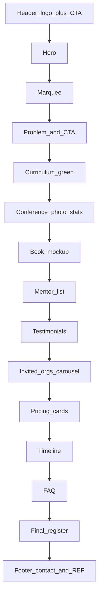

# Growing Young 台灣版單頁網站 SPEC

- 狀態：已實作靜態單頁（尚未部署 GitHub Pages）
- 參考原站：[https://www.hkccc.org/growingyoungcohort](https://www.hkccc.org/growingyoungcohort)（已獲授權仿製）
- 本階段交付：靜態單頁已完成。部署 GitHub Pages 需另外執行（推上 GitHub 後在 Settings → Pages 開啟）。

---

## 1. 技術決策

### 1.1 框架：純 HTML / CSS / JS，不用 React、Next、Vue

這是一頁行銷落地頁：沒有登入、沒有後端、沒有多頁路由。框架會帶來建置步驟、`node_modules`，以及之後改文案的門檻。純靜態檔案之後只要打開一個檔案改字、存檔、推上 GitHub 就上線。

### 1.2 托管：GitHub Pages，不用 Firebase Hosting

站點完全靜態。GitHub Pages 免費、跟 git 同一套流程、自訂網域也夠用。Firebase 適合以後真的要 Cloud Functions 或資料庫；目前刻意不做後端，Firebase 是多餘的。

之後若要換成自訂網域（例如 `growingyoung.tw`），在 repo 加 `CNAME` 即可。

---

## 2. 目標與非目標

### 要做

- 單頁（one-page）台灣版落地頁
- 視覺盡量對齊原站：字體、綠／深藍配色、斜切色塊、Hero 滿版圖、時間軸、FAQ 手風琴、回到頂端鈕
- 全站只有一種報名：按鈕連到既有 Google 表單（新分頁開啟）
- Footer 標註原站來源（授權聲明）
- 文案先沿用原站繁中當 placeholder，之後由內容負責人自行調整

### 不做

- 上方漢堡選單、學傳全站導覽、搜尋、社群 icon bar
- 「觀看體驗課程」按鈕、彈窗、姓名／email 收集
- 頁尾聯絡表單、電子報、任何後端或使用者資料儲存
- 團隊報名／個人報名兩條不同 Google 表單（原站是兩份；台灣版合併成一份）
- 會員、金流、CMS
- cookie banner、分析工具（之後若要加 Plausible／GA，另開需求）

---

## 3. 與原站的明確差異

| 原站 | 台灣版 |
| --- | --- |
| Squarespace 全站 header + hamburger | 極簡 header：logo +「立即報名」 |
| 團隊報名、個人報名兩顆鈕、兩份表單 | 全站同一顆「立即報名」 |
| 觀看體驗課程（收集 email 才給影片） | 整段刪除 |
| 頁尾聯絡表單 | 刪除；只留靜態聯絡文字（之後再改） |
| 頁尾學傳事工／其他連結清單 | 刪除 |
| 無來源標註 | Footer 加 REF 連結與授權說明 |

費用、場次、導師名單等**版面結構保留**（例如仍可寫團隊價／個人價），但點下去都進同一份表單。

---

## 4. 建議檔案結構（實作時才建）

```
/
├── SPEC.md              ← 本檔
├── index.html           ← 結構與所有可見文字（改文案主要改這裡）
├── css/
│   └── styles.css       ← 配色、版面、動畫
├── js/
│   └── main.js          ← FAQ、輪播、回到頂端
├── assets/              ← logo、Hero、書籍 mockup、背景圖
└── CNAME                ← 有自訂網域再加
```

### 之後改內容看哪裡

| 要改什麼 | 檔案 |
| --- | --- |
| 文字、價格、日期、導師、FAQ、聯絡方式 | `index.html`（搜尋 `SECTION:` 註解） |
| Google 表單網址 | `index.html` 最上面那一處 |
| logo／照片 | 檔案丟進 `assets/`，再改 `index.html` 對應 `src` |
| 顏色、間距、字級 | `css/styles.css` |
| 輪播／FAQ 行為 | `js/main.js`（改文案不必動） |

實作時在 `index.html` 頂部放明顯註解：

```html
<!-- 改報名表單：只改下面這個網址 -->
<!-- 改文案：搜尋 SECTION 註解，直接改區塊內中文 -->
```

Google 表單網址必須**只定義一次**，全站 CTA 共用，避免改十次。可用頂部常數註解 + 單一 `href` 來源，或頁面載入時由 JS 把同一個 URL 寫進所有 `.js-register` 連結。實作時擇一，但禁止在 HTML 裡複製貼上十個相同 URL。

建議常數 placeholder：

```text
GOOGLE_FORM_URL = https://docs.google.com/forms/d/e/REPLACE_ME/viewform
```

---

## 5. 頁面區塊（由上到下）



### 5.1 Header（固定）`<!-- SECTION: HEADER -->`

- 白底、sticky
- 左：主辦 logo（先用 placeholder 圖或文字「Growing Young 台灣」）
- 右：一顆「立即報名」
- **沒有**漢堡、**沒有**連到其他頁的 icon
- 點 logo 捲回頂端

### 5.2 Hero `<!-- SECTION: HERO -->`

- 滿版照片 + 深色遮罩
- 標題：Growing Young「讓教會年輕化課程」
- 主標：讓年輕人愛上你的教會
- 原站下方兩顆綠鈕是「團隊報名／個人報名」；台灣版改成**一顆**全寬綠鈕「立即報名」

Placeholder 文案沿用原站。Hero 圖先用授權原站照片。

### 5.3 跑馬燈 `<!-- SECTION: MARQUEE -->`

- 深藍底、白字、無限循環
- 文案：`與年輕人連結 | 不同堂會交流 | 一同實踐理論 |`

### 5.4 問題陳述 + 二次 CTA `<!-- SECTION: PROBLEM -->`

- 白底
- 大標（綠）：香港教會的青年事工正在下滑（之後改台灣文案）
- 不再年老化
- 讓堂會重新充滿年青活力
- 只留一顆綠鈕「立即報名」
- **刪除**原站那顆深藍「觀看體驗課程」
- 下緣接綠色斜切，接到下一區塊

### 5.5 課程主題 `<!-- SECTION: CURRICULUM -->`

- 綠底斜切區塊
- 標題：在這個計劃中，你將會學到⋯⋯
- 中間：GROWING YOUNG（雙底線）
- 主題列表，視覺對齊原站大白字；可用簡單直向輪播或直向堆疊

Placeholder 主題（沿用原站）：

- 六個核心承諾
- 香港成青面對的生命過渡
- 教練技巧：專注聆聽
- 教會更新的調適性領導力
- Growing Young
- 召命導向生涯規劃
- 處理衝突和情緒建康
- 青年事工聖經原則和神學反思

### 5.6 我們明白牧養青年的挑戰 `<!-- SECTION: EMPATHY -->`

- 禮堂照片 + 藍綠遮罩
- 標題：我們明白牧養青年的挑戰
- Emerging Adulthood Conference／青年牧養研討會 2023–2026
- 數據（之後可改）：
  - 累計 > 1000 位參與者
  - 來自 > 120 間機構
  - Growing Young Cohort 讓教會年輕化課程
  - 累計 23 間香港教會
  - 7 間台灣教會

### 5.7 書籍 mockup `<!-- SECTION: BOOK -->`

- 白底
- 出版《Growing Young》中文增修版及研習本
- 書封／mockup 圖（沿用授權圖當 placeholder）

### 5.8 導師與教練 `<!-- SECTION: MENTORS -->`

- 標題：導師及本地教練團隊包括：
- 副標：（名字按中文姓氏筆劃排序）
- 兩欄姓名列表
- 先放原站名單當 placeholder：

| 左欄 | 右欄 |
| --- | --- |
| 美國富勒神學院教授 | （原站此格為空，照放） |
| 李俊明牧師 | 陳保焜傳道 |
| 吳錦波牧師 | 陳義生博士 |
| 邵悅珊傳道 | 陶傳家牧師 |
| 姚敏慧傳道 | 蔡康怡牧師 |
| 許志超博士 | 盧德賢博士 |

### 5.9 見證輪播 `<!-- SECTION: TESTIMONIALS -->`

- 白底引文 + 職稱
- 左右 Previous／Next
- 先用原站五則：

1. 我們藉著這個課程有新的啟發，學會用新的角度去牧養我們的下一代⋯⋯  
   謝又新牧師｜播道會同福堂堂主任 (第一屆參與堂會)
2. 香港學傳在港開辦青少年牧養會議及招募伙伴教會，一起推動和協作，為處於低迷的香港教會帶來動力和想像。我在此誠意向你推薦。  
   梁國全傳道｜香港教會更新運動總幹事
3. 這個課程讓教會不同的崗位上可以一起配搭，一起共識一個目標 ⋯⋯ 為了教會這個青年牧養的工作來同心努力。  
   林克華牧師｜永興浸信會堂主任
4. 這個課程我們有意識形態的改變，讓教會群體由下而上也感受到有一種很銳意想更新的氣氛。  
   李俊明牧師｜華人神召會葵涌堂堂主任
5. 六大核心承諾讓人明白到教會年輕化不單是年輕信徒的牧者或導師的責任，乃是整個堂會文化的更新工程⋯⋯  
   梁朝傑執事｜葵涌平安福音堂 (第二屆參與堂會)

### 5.10 曾受邀機構 `<!-- SECTION: ORGS -->`

- 照片底 + 機構名稱／logo 輪播（Previous／Next）
- 標題：曾受邀到不同教會與機構分享成青牧養的議題
- 先用原站清單；台灣版之後可換成本地機構：
  - 香港基督教機構協會 (HKACO)
  - 播道神學院
  - 香港信義宗聯會
  - 香港神學教育協會 (HKTEA)
  - 使命門徒 Podcast
  - 香港浸信會神學院
  - 世界華福中心
  - 福音證主協會

### 5.11 課程詳情 `<!-- SECTION: DETAILS -->`

- 深藍底
- 標題：課程詳情
- 兩張資訊卡（結構保留，CTA 合併）：

**團隊方案（placeholder）**

- 名額：6 間堂會
- 每間堂會早鳥價 9,900 元（7 月 31 日或之前報名）
- 原價 12,000 元
- 贈品：每位參與者可獲贈一本《當教會遇上年輕人》
- 報名資格：
  - 每間堂會須組成 5–6 人的團隊
  - 團隊須由堂會中擔任不同領導角色的弟兄姊妹組成

**個人方案（placeholder）**

- 名額：10 人
- 每人 1,900 元
- 贈品：參與者可獲贈一本《當教會遇上年輕人》
- 注意：
  - 參與者必須出席開幕禮
  - 參與者須承諾出席大部分課堂，並認真完成作業

卡片上**不要**再放兩個不同報名連結；區塊底部或各卡共用「立即報名」。

### 5.12 課程時間表 `<!-- SECTION: SCHEDULE -->`

- 深藍底、水平時間軸
- 日期區間：2026 年 10 月 18 日 – 2027 年 5 月 1 日（placeholder）
- 節點：
  - 開幕禮：10 月 18 日（下午）、10 月 19 日（全日）
  - 實體課堂：3/11、17/11、1/12、15/12、5/1、19/1、2/2（隔週星期二晚上）
  - 閉幕禮：5 月 1 日（暫定）
- 地點：九龍靈糧堂，九龍仔嘉林邊道 1 號（placeholder，之後改台灣場地）

### 5.13 FAQ `<!-- SECTION: FAQ -->`

- 深藍底
- 標題：All churches grow old. Strategic churches are growing young.
- 手風琴 9 題，第一題預設展開
- `button` + `aria-expanded`
- FAQ 裡若提到「個人報名與團體報名差別」，實作時仍可保留題目（之後改寫），但頁面上不能出現第二個表單連結

**題目與答案（placeholder，沿用原站）：**

1. **甚麼是 Growing Young 讓教會年輕化課程？**  
   過往十年，富勒青年研究中心 (Fuller Youth Institute) 針對「教會年輕化」(Growing Young) 的課題調查 250 間青年事工卓越的教會，研究「哪些策略能有效地讓年輕人融入教會？」、「若想讓教會年輕化，具體可做些甚麼？」等問題。這研究歸納出「六個核心承諾」去幫助教會年輕化，也建議了一些具體步驟。  
   Growing Young Cohort（簡稱 GYC）便是基於此研究成果而設計的課程。這課程透過以下的活動，去幫助堂會按自身的處境，設計一系列計劃，去讓教會變得年輕化。

2. **讓教會年輕化課程包含甚麼？**
   - 課堂學習：由富勒神學院教授和認可導師指導，課堂主題涵蓋教會年輕化的六個核心承諾、香港成青面對的生命過渡、專注聆聽的教練技巧、調適型領導力、召命導向的生涯規劃、衝突處理與情緒健康，以及青年事工的聖經原則與神學反思
   - 教會評估 Church Assessment：啟發堂會需要成長的地方並制定建議
   - 教練約談：由富勒神學院青年研究中心認可的教練指導堂會團隊
   - 教會轉化計劃 Church Transformation Plan：在教練指導下，完成具體的教會轉化計劃
   - 堂會交流：與相似價值的主內同道彼此交流

3. **為甚麼二月已經完成課堂，五月才有閉幕禮？**  
   在這三個月中，在教練的引導下，期望參與者在教會嘗試實踐更新計劃，並在五月的閉幕禮中分享嘗試成果。

4. **個人報名與教會團體報名有甚麼分別？**  
   與教會團體報名一樣，個人報名者能參與整個課程的所有部分（包括開幕禮、實體課堂、閉幕研討會），以及獲 Emerging Adult Seminar 相關講座及工作坊的錄影片段和其他資源。  
   同樣地，在課程期間，個人報名者也會參與教練約談、聆聽之旅 Listening Tour、教會評估表 church assessment，和教會年輕化計劃書 Transformational Plan。希望能幫助個人報名者在其堂會開始實踐課程的內容。  
   （台灣版此題之後可改寫；頁面不得連到第二份表單。）

5. **甚麼是「成年初顯期」？**  
   在 2000 年，美國社會學家阿奈特（Jeffrey Arnett）提出把 18–29 歲劃分為一個新的生命階段—「成年初顯期」（Emerging Adulthood，簡稱成青期），以更準確地描述當今青年的新處境。今天的青年需要多 5–10 年才達到過往慣常認為成人的指標，如完成學業、開始工作、結婚、生小孩等。  
   成青期是一個充滿探索和機會的階段，同時又面對著轉變、不安和壓力的時期。成青的學業和工作比以往更多變和更忙碌，這令到成青往往不易穩定地出席教會活動。若教會不明白他們面對新處境，便會誤解他們為不忠心和不屬靈。若教會能以同理心回應成青的掙扎和挑戰，能提供支持和同行，成青信徒便不會流失，甚至能紮根在教會。

6. **一般團隊人數及資格如何？需要主任牧師參加嗎？**  
   建議每個團隊由 5–6 人組成，並由堂會中擔任不同領導角色的弟兄姊妹共同參與，例如青年牧者、長執、團契或小組組長，以及成青期的弟兄姊妹等。主任牧師的參與並非硬性規定，但若能一同參與，將有助於整體方向的配合與推動。

7. **功課量有多少？**  
   課程設有三項課外活動，包括聆聽之旅、教會年輕化評估問卷及教會更新計劃。每個團隊都會配有一位教練協助引導完成相關功課，確保既符合課堂期望，也切合各堂會的實際需要。

8. **參加這個課程後，會對教會現有架構帶來挑戰嗎？**  
   本課程旨在幫助教會掌握年輕化的原則與方向，並不期望一步登天。在制定更新計劃時，鼓勵由小處著手，在邊緣位置先作嘗試（testing on the margin），並在過程中與教會領袖持續討論與規劃，循序漸進地推動改變。

9. **完成課程後，是否有持續跟進的配套措施？**  
   部分過往參與者會繼續與教練聯繫。此外，學傳即將出版新書《Future Focused Church》，從領導力角度探討如何持續推動教會年輕化，並附有研習指南，協助教會進一步實踐與深化學習。

### 5.14 最終 CTA `<!-- SECTION: FINAL_CTA -->`

- 一顆「立即報名」（同樣連到唯一 Google 表單）

### 5.15 Footer `<!-- SECTION: FOOTER -->`

- 靜態聯絡：電話、email、地址（placeholder；可暫用原站 `2753 8887`、`growingyoung@hkccc.org` 與香港地址，之後改台灣資訊）
- **無** `<form>`、**無** checkbox、**無**學傳事工 sitemap、**無** Instagram／Facebook 導覽
- 必備 REF，例如：  
  「本頁視覺與課程架構參考香港學園傳道會 Growing Young 課程頁面，並已獲授權。」  
  連結到 [https://www.hkccc.org/growingyoungcohort](https://www.hkccc.org/growingyoungcohort)
- Copyright placeholder：`© 2026 Growing Young Taiwan`

### 5.16 回到頂端

- 右下圓鈕，捲動一段距離後顯示
- 行為比照原站

---

## 6. 視覺系統

對齊原站量測：

| Token | 值 | 用途 |
| --- | --- | --- |
| 綠 | `#23A458` | 主 CTA、綠區塊 |
| 深藍 | `#172436` | 跑馬燈、時間表、FAQ、深色區塊 |
| 點綴藍 | `#4292FA` | 原站「立即報名」實心藍；台灣版主 CTA **統一用綠**，避免兩套按鈕語言 |
| 白／黑 | `#FFFFFF` / `#000000` | 白底黑字；Hero／照片區塊白字 |

- 字體：英文 Poppins、中文 Noto Sans TC（Google Fonts）
- 區塊轉場：原站的對角斜切（green → navy）
- 斷點：手機優先（原站移動版為準）；桌機加寬 max-width，Hero 與時間軸改橫向
- `html lang="zh-Hant-TW"`
- `<title>`、meta description、OG 圖（可用 Hero 圖）

建議 title：`Growing Young 讓教會年輕化課程｜台灣`

---

## 7. 互動與技術約束

- 全站 CTA：`target="_blank"` `rel="noopener noreferrer"` 開 Google 表單
- 無 `<form>`、無第三方表單 embed（Google Form 只當外連，不 iframe）
- FAQ：`button` + `aria-expanded`；輪播有 Previous／Next，鍵盤可操作
- 圖片：實作時下載原站授權圖到 `assets/`，**不要** hotlink Squarespace CDN
- 不追蹤、不存使用者資料
- 回到頂端鈕不擋住主要 CTA

### 授權圖片來源（實作時下載到 assets，勿外連）

原站 Squarespace CDN（僅作為下載清單；授權範圍以雙方授權為準）：

- HKCCC logo（台灣版改 placeholder，不沿用香港學傳 logo 當正式主辦識別，除非另有授權）
- Hero 青年合照
- 綠區塊／斜切背景 `bg.png`
- 禮堂／研討會照片
- 書籍 mockup
- 機構輪播底圖與 logo

台灣版 header logo 預設用文字或之後提供的台灣主辦檔案，不要把香港學園傳道會 logo 當成台灣站正式識別。

---

## 8. 無障礙與 SEO

- Skip to content 連結可保留（連到主內容）
- 所有資訊性圖片有 `alt`；裝飾圖 `alt=""`
- 對比：綠底白字、深藍底白字須可讀
- 單一 `h1`（Hero 主標）；其後區塊用 `h2`
- Open Graph：`og:title`、`og:description`、`og:image`、`og:locale` = `zh_TW`

---

## 9. 部署（實作階段才做）

1. 將 repo 推上 GitHub
2. Settings → Pages → 來源選 `main` 的 `/`（root）
3. 網站網址為 `https://<user>.github.io/GrowingYoungTW/`（若 repo 在 organization 則依實際路徑）
4. 若專案不在 GitHub user site 根目錄，相對路徑請用相對於 `index.html` 的 `css/`、`js/`、`assets/`，不要用絕對網站根路徑，以免 GitHub project page 破圖
5. 自訂網域：加 `CNAME` 並在 DNS 設 apex／www

本 SPEC 階段**不**執行以上步驟。

---

## 10. 實作完成後給內容負責人的一句話

改字請打開 `index.html`，搜尋 `SECTION:`。改報名表單只改檔案最上面那一個網址。換照片放 `assets/`。不要改 `js/main.js`，除非輪播壞了。
